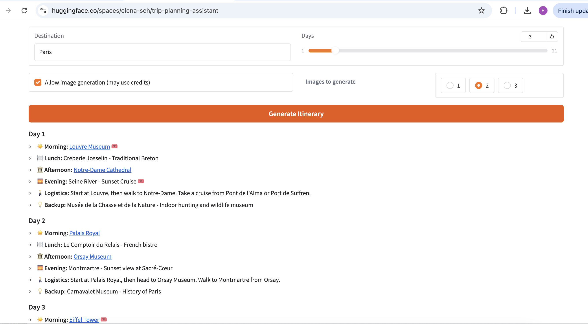
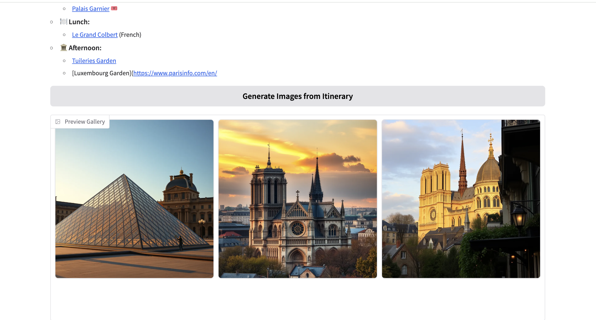

# VoyageAI — Your Travel Buddy

Gradio app deployed on Hugging Face Spaces that turns a destination + trip length into a clean, day-by-day itinerary with Google-Maps links. After the plan is shown, users can optionally generate 1–3 landmark images (FLUX) — images are **off by default** to control credits. The app is fast-first (text first, media later) and includes a static fallback if credits/rate limits are hit.

**Live demo:** https://huggingface.co/spaces/elena-sch/trip-planning-assistant

## Features
- Structured itinerary per day (Morning / Lunch / Afternoon / Evening / Logistics / Backup)
- Google-Maps style links for sights and food
- Optional AI images (opt-in after itinerary; 1–3)
- Cost-aware design (images off by default; fallback when credits exhausted)

## Tech stack
- **Gradio** UI on **Hugging Face Spaces**
- **Mistral** (text) via `huggingface_hub`
- **FLUX** (images), opt-in
- Secrets stored as **Space Secrets** / env vars (no tokens in code)

## Run locally
```bash
python -m venv .venv && source .venv/bin/activate   # Windows: .venv\Scripts\activate
pip install -r requirements.txt
export HF_TOKEN=...   # do NOT commit this
python app.py
```

## Screenshots



## License
Apache-2.0
